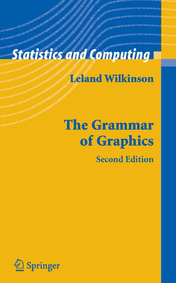

```{r setup, include=FALSE}
options(htmltools.dir.version = FALSE,
        width = 80)
pkggraph::init(local = TRUE)
knitr::opts_chunk$set(
  comment = "",
  size = "small",
  dev = "svg",
  fig.align = "center",
  fig.path = "figs/"
)

#https://www.garrickadenbuie.com/blog/2018/01/23/highlight-lines-without-breaking-the-code-in-xaringan/
hook_source <- knitr::knit_hooks$get('source')
knitr::knit_hooks$set(source = function(x, options) {
  x <- stringr::str_replace(x, "^[[:blank:]]?([^*].+?)[[:blank:]]*#<<[[:blank:]]*$", "*\\1")
  hook_source(x, options)
})
```


class: center, middle
# [tidyverse.org](https://tidyverse.org)

#### Everything is found here

.footnote[
https://tidyverse.org/ <br>
https://tidyverse.tidyverse.org/
]


???

The definitive guide and descriptions are found at tidyverse.org.  In fact, the majority of this presentation is borrowed from the official sources.
If you need 1 take home message, it should be "tidyverse.org"

The content on the intenet is great.
I should also disclaim, that I am no `tidyverse` expert.
I read (some of) this stuff so you do not have to.

### Shortcuts:
* `h` for help
* `number` + `Enter` go to page
* `b` for "black-out"
* `m` for "mirror"
* `f` to toggle full-screen 
* `c` for clone slides to a new browser window; slides in the two windows will be in sync as you navigate through them
* `p` for presenters mode 


---
class: middle, center

# Thank you


---
class: middle

```{r, comment = " "}
library(tidyverse)
tidyverse_logo()
```


???

Tidyverse is simply a collection of 8 core package with which share common design principles.
Or, more bluntly out: 'all the nice stuff from Hadley Wickham and co. at Rstudio'.

Each package probably warrents it's one presentation.


---
class: center

#### The `tidyverse` dependencies

```{r echo=FALSE, message=FALSE, warning=FALSE}
source("tidyverse_deps.R")$value
```

.left[
Press `ctrl`+`R` or `F5`
]


---
# A common design philsophy


* A shared concept of *tidy data*; the *tidy*verse, not the *messy*verse
     * Programs are for humans to read
     * Embrace functional programming
     * Use and reuse existing data structures
     * Compose simple functions with the pipe

* "There should be one, and preferably only one, obvious way to do it."

    * The **R** core team's philosophy is fundamentatlly different.

.footnote[
https://principles.tidyverse.org/ <br>
https://github.com/tidyverse/principles/issues <br>
https://tidyverse.tidyverse.org/articles/manifesto.html
]

???

* The traditional way of manipulating data in R is quite different from this
* That obvious way may not be obvious at first.
* R core team says: many ways to do the same thing.
* The grammar of graphics

---
# What is *tidy data*?

> Happy families are all alike; every unhappy family is unhappy in its own way.
> .right[*Leo Tolstoy*]

Data is *tidy* **if**:
1. Each variable forms a column.
2. Each observation forms a row.
3. Each type of observational unit forms a table. (A value must have it own cell)


.footnote[
Wickham, H. (2014). Tidy Data. Journal of Statistical Software, 59(10), 1-23. doi:http://dx.doi.org/10.18637/jss.v059.i10
]

???

* Speaks only toward 'rectcangular data' --- there is lots of data that is not naturally rectangular.
* Some 80% of data analysis is used on cleaning and preparing data (Dasu and Johnson 2003)
* You feel that the 1--2 is tautological, but if you think long-vs-wide tables it should be apparent it is not.
* It is sometimes surprisingly difficult to precisely define variables and observations.
    * Rule of thumb: it's easier to describe functional relationships between variables than between rows, 
    * it is easier to make comparisons between groups of observations than between groups of columns. 


---
# What is **not** tidy data?

>* Column headers are values, not variable names.
>* Multiple variables are stored in one column.
>* Variables are stored in both rows and columns.
>* Multiple types of observational units are stored in the same table.
>* A single observational unit is stored in multiple tables.

* Contingency tables / *n*-factor tabulation arrays

.footnote[
Wickham, H. (2014) http://dx.doi.org/10.18637/jss.v059.i10
]

???


---
class: middle

### Tidy?
```{r}
print(AirPassengers) # Monthly Airline Passenger Numbers 1949-1960
```
                


---

# `%>%`

#### `value %>% function(...)` 
is equivalent to
#### `function(value, ...)`

    Univariate f:    x %>% f  is the same as  f(x) 
    Multivariate g:  x %>% g  is the same as  g(x, y, ...)

```{r}
iris %>% 
  subset(Species == "setosa", select = names(.)[-4]) %>%
  head(n=2)
```
```{r, eval=FALSE} 
head(subset(iris, Species == "setosa", select = names(iris)[-4]), n = 2) # The same
```


???

Called the pipe operator; performs function composition.
From the pacakge `magrittr`; adopted by `tidyverse`.
Can give some expressive code by daisy chaining pipes.
The dot `.` can be used as placeholder to place the left hand size elsewhere or use
the `value` for other purposes.


---
class: center, middle, inverse

# [`tibble`](https://tibble.tidyverse.org/)

.footnote[
https://tibble.tidyverse.org/
]


---
### tibbles

```{r}
tbl <- tibble(x = 1:50, y = exp(x), w = y > 1, char = "AaRUG")
tbl
class(tbl)
```

???

Much like the data.frame but with all the annoying stuff taken away.
Creating tibbles are covered in syntactic sugar.
It extends the data.frame; but actually "dumber."
All tibbles are data.frames; but not all data.frames are tibbles.

They feature:
* Better printing
* Only recycles length 1 inputs.
* Evaluates its arguments lazily and in order.
* Never coerces inputs (i.e. strings stay as strings!).
* Never adds row.names.
* Never munges column names.
* Adds tbl_df class to output.
* Automatically adds column names.


---
### tibbles (cont.)

Subsetting via "[" does not "drop". Subsetting with "$" does.
```{r}
tbl[25, ]
print(tbl[, "y"], n = 3)
str(tbl$y)
```


---
### tibbles (cont.)

Also no partial matching!

```{r}
tbl$ch
data.frame(a = 1, char = "test")$ch
```


### tibbles do less and compain more

???

Hopefully this should lead to more expressive code and confront problems


---
class: center, middle, inverse

# [`readr`](https://readr.tidyverse.org/)

.footnote[
https://readr.tidyverse.org/
]


---
class: middle

```{r}
mtcars <- read_csv(readr_example("mtcars.csv"))
mtcars$car <- rownames(datasets::mtcars)
```

#### Features:
* Returns tibbles
* Allegedly 10x faster than base **R**  
* Strings are parsed as-is (not more `stringsAsFactors = FALSE`)
* Parses common data-time formats
* Progress indicator for large files
* Do not depend on locale (US default)

???

* `file` Either a path to a file, a connection, or literal data
* Argument `col_types` accepts the copy-paste of the output.

---
class: middle

#### `readr` supports:

```{r, eval=FALSE}
read_csv()    # comma separated (CSV) files
read_tsv()    # tab separated files
read_delim()  # general delimited files
read_fwf()    # fixed width files
read_table()  # tabular files with white-space separated columns
read_log()    # web log files
```


---
class: center, middle, inverse

# [`dplyr`](https://dplyr.tidyverse.org/)

.footnote[
https://dplyr.tidyverse.org/
]

???

* dplyr is a grammar of data maninulation *on tidy data*
* (Relatively) consistent
* Provide few 'verbs' to do most things --- one-way philosophy
* Fast, not not built for speed. `data.table` might be better here.

From the docs:pp

> * Identify the most important data manipulation verbs and make them easy to use from R.
> * Provide blazing fast performance for in-memory data by writing key pieces in C++ (using Rcpp)
> * Use the same interface to work with data no matter where it's stored, whether in a data frame, a data table or database.

---
### dplyr overview

Core functionalty:

* `select()` columns
* `filter()` rows
* `arrange()` / sort rows
* `mutate()` and `transmute()`: add new columns

Reduce/summarize (groups of) rows with:

* `summarise()`, `summarize()`

and 

* `group_by()`, `ungroup()`


---
### `mtcars`


```{r}
mtcars %>% print(n = 5, width = 60)
```

---
### Basic dplyr in action
```{r}
mtcars %>% 
  filter(cyl %>% between(4,6)) #<<
```

???

* `filter` has helper functions `between`, `near`, ``xor`

---
### Basic dplyr in action
```{r}
mtcars %>% 
  filter(cyl %>% between(4,6)) %>% 
  select(car, mpg:wt, -drat) # also supports -(colX:colY)  #<<
```

???

* `select` has helper functions `starts_with`, `ends_with`, `contains`, `matches`


---
### Basic dplyr in action
```{r}
mtcars %>% 
  filter(cyl %>% between(4,6)) %>% 
  select(car, mpg:wt, -drat) %>%
  mutate(wt = 0.45*wt, `hp/wt` = hp/wt) #<<
```

???

* `mutate` supports multiple new columns, created in order
    - mtcars %>% mutate(cyl_disp_ccm = 16.387064*disp/cyl, cyl_disp_L = cyl_disp_ccm/1000)
* `mutate` has helper functions `cumall`, `cumany`, `recode`, `case_when`, `percent_rank`
* `transmute` would just return the derived value

---
### Basic dplyr in action
```{r}
mtcars %>% 
  filter(cyl %>% between(4,6)) %>%
  select(car, mpg:wt, -drat) %>%
  mutate(wt = 0.45*wt, `hp/wt` = hp/wt) %>%
  arrange(desc(`hp/wt`)) #<<
```

---
### Basic dplyr in action
```{r}
mtcars %>% 
  filter(cyl %>% between(4,6)) %>% 
  select(car, mpg:wt, -drat) %>%
  mutate(wt = 0.45*wt, `hp/wt` = hp/wt) %>% 
  arrange(desc(`hp/wt`)) %>% 
  group_by(cyl) #<<
```

---
### Basic dplyr in action
```{r}
mtcars %>% 
  filter(cyl %>% between(4,6)) %>% 
  select(car, mpg:wt, -drat) %>%
  mutate(wt = 0.45*wt, `hp/wt` = hp/wt) %>%
  arrange(desc(`hp/wt`)) %>% 
  group_by(cyl) %>%  
  summarize(mean_hpwt = mean(`hp/wt`), tanh = tanh(mean_hpwt)) #<<
```

???

* Doing the above it "[" would be a nightmare in comparison
* Again lazy evaluation, in order is generally supported.
* 'Context-refence' (NSE as Janus talked about last time)

---
class: center, middle

# [`dbplyr`](https://dbplyr.tidyverse.org/)

.footnote[
https://dbplyr.tidyverse.org/
]

???

* `dbplyr` is a database backend for `dplyr`
* Unlike "[", it abstracts away how the data is stored
* Converts `dplyr` code to SQL calls
* Expressions are lazily evaluated and `dplyr` pipes generate SQL, which is sent to the DB only when requested.


---
class: center, middle, inverse

# [`tidyr`](https://tidyr.tidyverse.org/)

.footnote[
https://tidyr.tidyverse.org/
]


---
class: center, middle

> The goal of `tidyr` is to help you create **tidy data**.

.footnote[
https://tidyr.tidyverse.org/
]


---
### Key tidyr functions

* `gather()`: *gathers* ultiple columns into two key-value columns
  - i.e. wide to long format

* `spread()`: *spreads* two columns (key & value) into multiple columns
  - i.e. long to wide format

* `separate()`: pulls apart one `character` column into many (inverse of `unite()`)
  - `separate_rows` separate into extra rows
  
* `extract()`: similar, but uses regex to capture groups


???

* Alternative to `reshape` and `reshape2` packages.


---
### Other tidying
#### Handle missing values
* `drop_na()`  filters `NA`
* `fill()`  fills `NA` with most recent non-`NA` (from top og bottom)
* `replace_na()`
* `complete()`: Expand current tibble to make missing values explicit
* `expand()`: Creates a new tibble (like `expand.grid`)


---
### tidyr in action
```{r, echo = -1}
WHO_tuberculosis <- table5[-6, ]
WHO_tuberculosis #<<
```

.footnote[
http://www.who.int/tb/country/data/download/en/
`tidyr::table5`
]

---
### tidyr in action
```{r}
WHO_tuberculosis %>% 
  unite(col = "year", century, year, sep = "")   #<<
```

---
### tidyr in action
```{r}
WHO_tuberculosis %>% 
  unite(col = "year", century, year, sep = "") %>% 
  separate(rate, into = c("cases", "pop"))  #<<
```

---
### tidyr in action
```{r}
WHO_tuberculosis %>% 
  unite(col = "year", century, year, sep = "") %>% 
  separate(rate, into = c("cases", "pop")) %>% 
  gather(cases, pop, key = type, value = count) #<<
```

---
### tidyr in action
```{r}
WHO_tuberculosis %>% 
  unite(col = "year", century, year, sep = "") %>% 
  separate(rate, into = c("cases", "pop")) %>% 
  gather(cases, pop, key = type, value = count) %>% 
  complete(country, year, type) #<<
```

---
### tidyr in action
```{r}
WHO_tuberculosis %>% 
  unite(col = "year", century, year, sep = "") %>% 
  separate(rate, into = c("cases", "pop")) %>% 
  gather(cases, pop, key = type, value = count) %>% 
  complete(country, year, type) %>% 
  replace_na() #<<
```


---
class: center, middle, inverse

# [`purrr`](https://purrr.tidyverse.org/)

.footnote[
https://purrr.tidyverse.org/
]


---
class: middle
### Functional programming

* Abstracts away for-loops
* Consistent interface for working with vectors (incl. lists) and functions
* Alternative to the `apply` family 

???

* Code should be easier to read and reason about
* Downside, I think it gets quite complex quit easily (but I'm not used to reason that way)


---
### Motivation
```{r, echo = -1}
set.seed(1)
tbl <- tibble(a = rnorm(10, mean = 100), b = rnorm(10, mean = 100),
              c = rnorm(10, mean = 100), d = rnorm(10, mean = 100))
print(tbl)
```
Say we want to compute the standard deviation for each column.


---
### Motivation (cont)
```{r}
sd(tbl$a)
sd(tbl$b)
sd(tbl$c)
sd(tbl$d)
```

---
### Motivation (cont)
```{r}
out <- vector("numeric", ncol(tbl))
for (i in seq_along(out)) {
  out[i] <- sd(tbl[[i]]) #<<
}
out
```


---
### Motivation (cont)
```{r}
out2 <- sapply(tbl, sd)
out2
```

---
### Motivation (cont)
```{r}
out3 <- purrr::map(tbl, sd)  # basically identical with lapply
out3
```

---
### Motivation (cont)
```{r}
out4 <- purrr::map_dbl(tbl, sd)
out4
```

---
### Motivation (cont)
```{r}
out5 <- purrr::map_chr(tbl, sd)
out5
```


---
### Remember tibbles (and data.frames) are lists
```{r}
mtcars %>%
  split(.$cyl) %>% # from base R
  map(~ lm(mpg ~ wt, data = .)) %>%
  map(summary) %>%
  map_dbl("r.squared")
```


???

<!-- from https://purrr.tidyverse.org/ -->
* The first argument is always the data, so `purrr` works naturally with the pipe.
All purrr functions are type-stable. 
* They always return the advertised output type (map() returns lists; map_dbl() returns double vectors), or they throw an error.
* All map() functions either accept function, formulas (used for succinctly generating anonymous functions), a character vector (used to extract components by name), or a numeric vector (used to extract by position).


---
class: middle

### Multivariate map
```{r}
mu <- list(5, 10, -3)
sigma <- list(1, 3, 6)
map2(mu, sigma, rnorm, n = 4)
```

* `pmap` generalizes `map2` this to p-arguments (to avoid `map3`, `map4`, ...)


---
#### Invoking different functions

```{r}
f <- c("runif", "rnorm", "rpois")
param <- list(
  list(min = -1, max = 1), 
  list(sd = 5), 
  list(lambda = 10)
)
invoke_map(f, param, n = 5) 
```

---
#### Works well with `tibbles`
```{r}
sim <- tribble(
  ~f,      ~params,
  "runif", list(min = -1, max = 1),
  "rnorm", list(sd = 5),
  "rpois", list(lambda = 10)
)
print(sim)
sim %>% 
  mutate(sim = invoke_map(f, params, n = 10))
```


---
### `reduce` & `accumulate`
```{r}
vs <- list(
  c(1, 3, 5, 6, 10),
  c(1, 2, 3, 7, 8, 10),
  c(1, 2, 3, 4, 8, 9, 10)
)
vs %>% reduce(intersect)

x <- c(1,5,2,3)
x %>% accumulate(`-`)  # cummulative difference
```


---
class: center, middle, inverse

# [`stringr`](https://stringr.tidyverse.org/)

.footnote[
https://stringr.tidyverse.org/
]


---
class: middle

### Consistent string manipulation functions
* `str_` prefixed functions

```{r}
ls("package:stringr")
```

???

* Consistent interface to string manipulation
* Of course 

---
class: middle

```{r}
ls("package:stringr") %>% head(n = 18) %>% 
  str_view_all("str_|ex")
```

???

* I want to highlight `str_view_all` which brings up a html_widget to show matches.
  - Helpful when making a regex


---
class: center, middle, inverse

# [`forcats`](https://forcats.tidyverse.org/)

.footnote[
https://forcats.tidyverse.org/
]

???

>  The goal of the `forcats` package is to provide a suite of tools that solve common problems with factors, including changing the order of levels or the values. 


---

###  Consistent manipulating of factors


```{r}
ls("package:forcats")
```


---
```{r, }
fct_explicit_na( factor(c("A","B",NA)) )
fct_c( factor(c("A","B") ), factor(c("B","C")) )
fct_rev( factor(c("A","B")) )
fct_drop( factor(c("A","B", NA), levels = c("A","B","C")) )
fct_anon (factor(c("A","B",NA)) , prefix = "cat" )
```

???

* Some forcats examples


---
class: center, middle, inverse

# [`ggplot2`](https://ggplot2.tidyverse.org/)

.footnote[
https://ggplot2.tidyverse.org/
]

???

* Now over 10 years old
* Probably needs a separate presentation.


---
### Foundations


.pull-left[

]

.pull-right[

]

.footnote[
http://vita.had.co.nz/papers/layered-grammar.html
]


---
class: center, middle

#### Data
<!--  -->
```{r tbl, echo = FALSE}
n <- 4
set.seed(1)
tbl <- tibble::tibble(A = rep(" ", n), B =  " ", C = " ", D = " ", E = " ")
kableExtra::kable_styling(knitr::kable(tbl), font_size = 18)
```


.pull-left[

#### Coordinate system
<!--  -->

```{r, echo = FALSE}
plot(1, axes = FALSE, type = "n", xlab = "<axis label>", ylab = "<axis label>")
grid(col = "#000000FF")
axis(1, at = axTicks(1), labels = rep("<tick lab>", length(axTicks(1))))
axis(2, at = axTicks(2), labels = rep("<tick lab>", length(axTicks(2))))
```

]

.pull-right[         
#### Aesthetics

```{r, echo = FALSE}             
n <- 3                          
m <- 3
o <- n*m                                         
mat <- matrix(seq_len(o), n, m)
plot(c(col(mat)), 
     c(row(mat)),         
     xlim = c(0, n + 1),
     ylim = c(0, m + 1),
     pch = c(0, 1, 2, 15, 16, 17, 22, 21, 24),
     col = c(rep("grey", m), 
             c("steelblue", "tomato", "seagreen2"),
             rep("black", m)),
     bg = c(rep("grey", m), 
             c("steelblue", "tomato", "seagreen2"),
             c("steelblue", "tomato", "seagreen2")),
     lwd = 3,
     cex = 6,
     axes = FALSE, 
     xlab = "", 
     ylab = "")
```

]


???

* The core elements of the grammar of graphics
* Aesthetics also called "geoms"


---
class: middle

```{r, eval = FALSE}
ggplot(data = <DATA>) +
  <geom_function>(mapping = aes(<aesthetics_mappings>))
```


---
class: middle

```{r, fig.align='center', dev="png", out.width='100%', fig.height=4, fig.width=7, dev='svg'}
my_mtcars <- mtcars %>% mutate(cyl = fct_rev(factor(cyl)))
ggplot(data = my_mtcars) +
  geom_point(mapping = aes(x = disp, y = mpg, col = cyl))
```

???

* Notice the "pipe" is "+". But it is not a pipe


---
class: middle

```{r, fig.align='center', dev="png", out.width='100%', fig.height=4, fig.width=7, dev='svg'}
ggplot(data = my_mtcars) +
  geom_point(mapping = aes(x = disp, y = mpg, col = cyl, 
                           shape = cyl, size = hp))
```

???

The coordinate system is by default the cartesian

---
class: middle, center

### More grammar...

`facet`

`position` 

`stat`

???

* position e.g. maps to bar plots
* stats: statistical transformations (mean, median, etc)
* non-cartesian coordiante systems

---
class: middle

```{r, eval = FALSE}
ggplot(data = <DATA>) +
  <geom_function>(
    mapping = aes(<aesthetics_mappings>),
    stat = <stat>,
    position = <postion>
  ) +
  <coordinate_function>() +
  <facet_function>()
```

???

* There's lots more to it...


---
```{r, message=FALSE, out.width = "100%", out.height="400px"}
it <- map_data("italy")
ggplot(it, mapping = aes(long, lat, group=group)) +
  geom_polygon(color = "black", fill = "white") +
  coord_quickmap()
```


---
```{r, out.width = "100%", out.height="400px"}
ggplot(it, mapping = aes(long, lat, group=group, fill=region))+
  geom_polygon(color = "black", show.legend = FALSE) +
  coord_quickmap()
```

---
```{r, out.width = "100%", out.height="400px"}
ggplot(it %>% filter(group <= 6), 
       mapping = aes(long, lat, group = group, fill = region))+
  geom_polygon(color = "black", show.legend = FALSE) +
  coord_quickmap() +
  facet_wrap(~ region)
```


---
class: inverse, center, middle

# More help

.left[
* Within R studio: `Help > Cheatsheet`
* The [R for Data Science](https://r4ds.had.co.nz/) book [1]
]

.footnote[
[1] https://r4ds.had.co.nz/
]

???

Again searching the internet gets you help nearly all the time.


